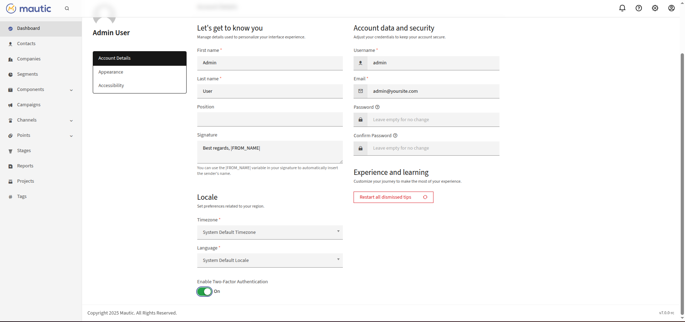
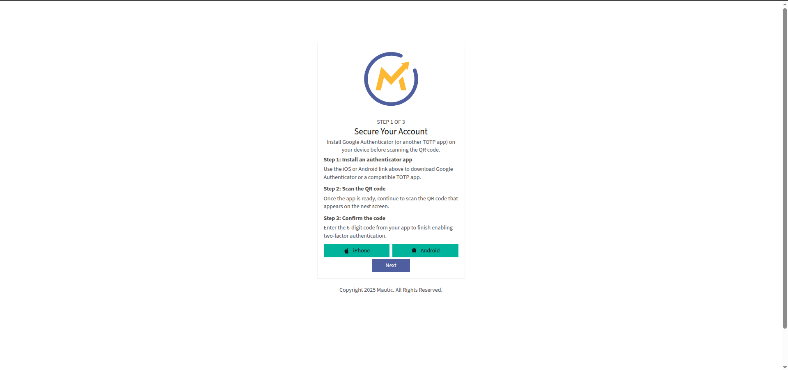
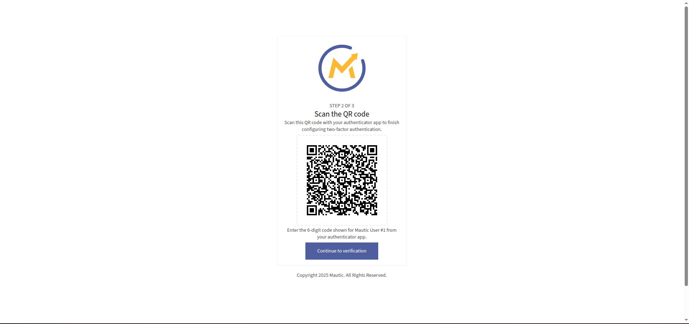
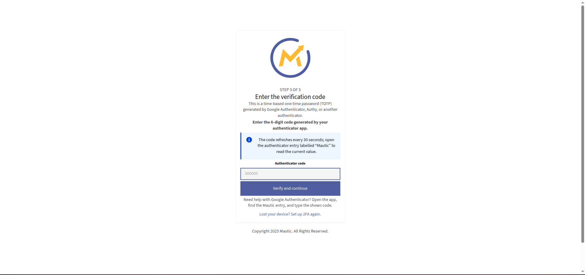

# Mautic 7 Two-Factor Authentication (2FA) Plugin


## 📘 Overview

The **Mautic 7 Two-Factor Authentication Plugin** enhances account security by adding a second layer of authentication using Time-based One-Time Passwords (TOTP), such as those generated by **Google Authenticator**, **Authy**, or any compatible app.

This plugin allows users to enable, configure, and verify 2FA during login, ensuring enhanced protection against unauthorized access.

---


## ⚙️Features

- Google Authenticator–compatible QR code generation  
- Time-based One-Time Password (TOTP) verification  
- Secure key storage in the database  
- Option to enable/disable 2FA per user  
- Recovery and reconfiguration support  
- Fully compatible with **Mautic 7.x**
- QR Code generation via **Endroid QR Code v6**
- TOTP generation and validation via **OTPHP v11.3**
- Secure per-user secret key storage


---

##  🧩Requirements

| Dependency | Version |
|-------------|----------|
| PHP | 8.1 or higher |
| Mautic | ^7.0 |
| endroid/qr-code | ^6.0 |
| spomky-labs/otphp | ^11.3 |
| Composer | Latest |

---
# VivanWebSolution Mautic 7 2FA Plugin

1. **Clone or copy** the plugin into the Mautic `plugins/` directory:

```bash
cd /path/to/mautic/plugins
git clone https://github.com/yourusername/MauticTwoFactorAuthBundle.git MauticTwoFactorAuthBundle
```
After installation, make sure to clear the cache and run any necessary migrations:


```bash
php bin/console cache:clear
php bin/console doctrine:migrations:migrate
```
Clear cache and reload plugins:

```
php bin/console mautic:plugins:reload
php bin/console cache:clear
```

2. Go to **Settings → Plugins** in Mautic and enable
Two-Factor Authentication Plugin.

## 🚀 Installation

### Step 1: Require dependencies

Run this command to install the necessary packages:

```bash
composer require endroid/qr-code:^6.0 spomky-labs/otphp:^11.3
```

## 🔐Configuration

1. Log in to Mautic as an administrator.

2. Navigate to **Settings → User Account → Two-Factor Authentication**.

3. Click **Enable 2FA**.

4. A QR code will appear — scan it using **Google Authenticator** or a compatible TOTP app.

5. Enter the 6-digit code to confirm activation.

6. Once activated, users will be prompted to enter a 2FA code during each login.
## Usage

1. **Log in** to the Sylius Admin panel.

2. Navigate to the **Admin User detail page**.

3. Use the **checkbox** in the "Two-Factor Authentication" section to enable or disable Google 2FA for that admin user.

4. When 2FA is enabled, the user will be prompted to enter a **Google Authenticator code** after logging in with their credentials.

## 🧰Database Changes
The plugin adds the following columns to the users table:
| Column                  | Type         | Description                               |
| ----------------------- | ------------ | ----------------------------------------- |
| `twofactor_enabled`     | TINYINT(1)   | Whether 2FA is active (1) or disabled (0) |
| `twofactor_secret`      | VARCHAR(255) | Stores the user's permanent secret key    |
| `twofactor_temp_secret` | VARCHAR(255) | Stores a temporary secret during setup    |


## 🧭 References

- [Mautic 7 Documentation](https://developer.mautic.org/) – Official developer documentation for Mautic 7 core and plugin structure.  
- [Endroid QR Code v6](https://github.com/endroid/qr-code) – Used to generate secure QR codes for 2FA setup within Mautic.  
- [Spomky-Labs OTPHP v11](https://github.com/spomky-labs/otphp) – Provides Time-based One-Time Password (TOTP) generation and validation.  
- [Symfony Framework](https://symfony.com/doc/current/index.html) – The foundation on which Mautic 7 and this plugin are built.  

## Functionality Screenshot
 
| Feature             | Screenshot                                       |
| ------------------- | ------------------------------------------------ |
| Enable 2FA          |      |
| Mobile App Example  |        |
| QR Code Display     |             |
| Verification Prompt |     |

## 📜 License

This plugin is released under the MIT License
.